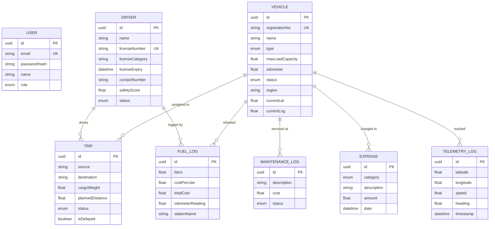

<p align="center">
  
</p>

<h1 align="center">🚛 TransitOps v2 ERP</h1>

<h3 align="center">Smart Transport Operations Platform</h3>

<p align="center">
  <strong>Enterprise Fleet Control & Real-Time Telemetry</strong><br/>
  Powered by Domain-Driven layered architecture with asynchronous RabbitMQ AMQP messaging and Socket.io high-frequency tracking.
</p>

<p align="center">
  
  
  
  
  
  
  
  
</p>

---

## 📋 Table of Contents

- [Overview](#-overview)
- [Key Features](#-key-features)
- [Screenshots](#-screenshots)
  - [Authentication & RBAC](#1--authentication--role-based-access-control)
  - [Operations Dashboard](#2--operations-dashboard)
  - [Live Fleet Map](#3--live-fleet-map--gps-telemetry)
  - [Vehicle Registry](#4--vehicle-registry--status-lifecycle)
  - [Driver Profiles](#5--driver-profiles--compliance-tracking)
  - [Trip Dispatching](#6--trip-dispatching--lifecycle-control)
  - [Shop Maintenance](#7--shop-maintenance--repair-control)
  - [Fuel Logs](#8--fuel-logs--efficiency-tracking)
  - [Expense Accounting](#9--financial-ledger--expense-accounting)
  - [Analytics & Reports](#10--executive-analytics--erp-reporting)
  - [Notifications](#11--real-time-notifications)
  - [RabbitMQ Infrastructure](#12--rabbitmq-message-broker-infrastructure)
- [Architecture](#-architecture)
- [Tech Stack](#-tech-stack)
- [Database Schema](#-database-schema)
- [Business Rules Engine](#-business-rules-engine)
- [Getting Started](#-getting-started)
- [Project Structure](#-project-structure)
- [API Modules](#-api-modules)
- [Demo Accounts](#-demo-accounts)

---

## 🌟 Overview

**TransitOps** is a production-grade, full-stack **Fleet Management ERP** designed for Indian transport and logistics enterprises. It provides end-to-end visibility over vehicles, drivers, trips, maintenance, fuel, and expenses — all backed by **real-time GPS telemetry**, **event-driven AMQP messaging**, and **live WebSocket dashboards**.

The platform enforces **10+ pre-trip business rules** (cargo capacity limits, driver license compliance, automatic asset locking) and delivers **executive-grade analytics** with exportable CSV/JSON reports.

---

## 🚀 Key Features

| Category | Capabilities |
|---|---|
| 🔐 **Authentication** | JWT-based auth, 4 RBAC roles (Fleet Manager, Driver, Safety Officer, Financial Analyst) |
| 📊 **Dashboard** | Real-time KPIs, fleet status donut chart, 14-day expenditure trends, safety leaderboard |
| 🗺️ **Live Fleet Map** | OpenStreetMap + Leaflet with GPS simulator, color-coded telemetry markers per vehicle status |
| 🚛 **Vehicles** | Kanban/List views, status lifecycle (Available → On Trip → In Shop → Retired), registration forms |
| 👥 **Drivers** | Compliance tracking, safety scores (0-100), license expiry monitoring, status management |
| 📦 **Trips** | Dispatch workflow with 10 business rules, lifecycle stages (Draft → Dispatched → In Progress → Completed) |
| 🔧 **Maintenance** | Repair order logging, cost estimates, asset interlock (auto-locks vehicle to IN_SHOP, releases on complete) |
| ⛽ **Fuel Logs** | Fill-up receipt tracking, odometer progression validation (Rule 9), cost/litre analytics |
| 💰 **Expenses** | 6-category financial ledger (Toll, Maintenance, Fuel, Salary, Insurance, Other), voucher posting |
| 📈 **Reports** | 30-day cumulative cost trajectory, cost center breakdown, driver safety rankings with ISO 39001 compliance |
| 🔔 **Notifications** | Real-time push notifications for trip status changes via WebSocket |
| 🐇 **Message Queue** | RabbitMQ AMQP for async event processing (10 queues, topic exchange) |

---

## 📸 Screenshots

### 1. 🔐 Authentication & Role-Based Access Control

<p align="center">
  
</p>

> **Enterprise Login Portal** — Odoo-inspired split-screen design with instant demo account auto-fill for 4 RBAC roles: **Fleet Manager**, **Driver**, **Safety Officer**, and **Financial Analyst**.

---

### 2. 📊 Operations Dashboard

<p align="center">
  
</p>

The command center provides at-a-glance visibility into your entire fleet operation:

| KPI Card | Description |
|---|---|
| **Total Fleet** | Total registered vehicle assets |
| **En Route** | Vehicles currently on active trips |
| **In Shop** | Vehicles under maintenance repair |
| **Trips Dispatched** | Total trips logged in the system |
| **On-Time Rate** | Percentage of trips delivered on schedule |
| **Total Spend** | Cumulative operational expenditure (₹) |

**Charts & Widgets:**
- 🍩 **Fleet Status Distribution** — Donut chart showing Available / On Trip / In Shop / Retired breakdown
- 📊 **Expense Breakdown** — Bar chart by category (Toll, Maintenance, Fuel, Salary, Insurance, Other)
- 📈 **14-Day Expenditure Trend** — Stacked bar chart comparing Fuel (₹) vs Other (₹) daily spend
- 🏆 **Safety Leaderboard** — Top 4 drivers ranked by safety index score

**Quick Actions:** Dispatch Trip • Shop Check-In • Log Fuel • Export Reports

---

### 3. 🗺️ Live Fleet Map & GPS Telemetry

<p align="center">
  
</p>

> **OpenStreetMap Real-Time Fleet Telemetry** — Continuous GPS interpolation along major Indian transit corridors (Mumbai → Pune, Delhi → Jaipur, Bangalore → Chennai).

| Telemetry Marker | Meaning |
|---|---|
| 🔵 Cyan Pulse | On Trip (Active GPS Pulse) |
| 🟢 Green | Available (Hub / Depot) |
| 🟠 Orange | In Shop (Maintenance Log) |

**Stats:** Tracked Fleet Size • Active En Route Pulse • Average Transit Speed (km/h)
**Controls:** Start/Pause GPS Simulator Loop • Search by registration • Filter by status

---

### 4. 🚛 Vehicle Registry & Status Lifecycle

<table>
  <tr>
    <td width="70%">
      
    </td>
    <td width="30%">
      
    </td>
  </tr>
</table>

**Kanban View** displays every asset as a card with registration number, model, type, capacity, odometer reading, and region. Toggle between **Kanban** and **List** views.

<table>
  <tr>
    <td width="50%">
      
    </td>
    <td width="50%">
      
    </td>
  </tr>
</table>

**Vehicle Status Lifecycle:**
```
Available ──→ On Trip ──→ Available
    │                         ↑
    └──→ In Shop ─────────────┘
    │
    └──→ Retired (end of life)
```

**Vehicle Types Supported:** Truck • Van • Bus • Car • Motorcycle

---

### 5. 👥 Driver Profiles & Compliance Tracking

<table>
  <tr>
    <td width="65%">
      
    </td>
    <td width="35%">
      
    </td>
  </tr>
</table>

Each driver card displays:
- 🪪 **License Number** (e.g., GJ-2014-2171951)
- 📋 **License Category** — D (Heavy Bus), MCWG (Motorcycle With Gear), LMV (Light Motor Vehicle), CE (Heavy Trailer)
- 📅 **License Expiry Date** with automatic compliance alerts
- 📞 **Contact Number** (+91 format)
- 🛡️ **Safety Score** (0–100 index, color-coded)

<table>
  <tr>
    <td width="50%">
      
    </td>
    <td width="50%">
      
    </td>
  </tr>
</table>

**Driver Statuses:** Available • On Trip • Off Duty • Suspended

---

### 6. 📦 Trip Dispatching & Lifecycle Control

<p align="center">
  
</p>

> Enforcing **10 pre-trip business rules**: cargo capacity limits, driver compliance, and automatic AMQP asset locking.

<table>
  <tr>
    <td width="50%">
      
    </td>
    <td width="50%">
      
    </td>
  </tr>
</table>

**Dispatch Form Features:**
- Smart vehicle selection showing capacity & odometer
- Compliant driver selection showing license expiry & safety score
- ⚠️ **Real-time cargo weight validation** — Highlights red if weight exceeds vehicle capacity
- Origin & destination hub selection from Gujarat transit network
- Scheduled departure & arrival date-time pickers

**Trip Lifecycle Stages:**
```
Draft ──→ Dispatched (Pending Start) ──→ In Progress (En Route) ──→ Completed (Delivered)
                                                                        │
                                                                  Cancelled
```

---

### 7. 🔧 Shop Maintenance & Repair Control

<p align="center">
  
</p>

> **Automatic asset state interlocks**: logging a shop repair locks the vehicle to `IN_SHOP`; completion releases the asset back to `AVAILABLE`.

| Column | Details |
|---|---|
| Vehicle Reg | Gujarat registration number |
| Repair Order Title | Description of maintenance work |
| Priority | Severity indicator |
| Cost Estimate | Repair cost in ₹ |
| Current Status | Open / In Progress / Completed |
| Interlock Action | Mark Complete & Release / Asset Released |

**KPIs:** Active In Shop • Scheduled Repairs • Completed Service • Total Shop Expenditure (₹)

---

### 8. ⛽ Fuel Logs & Efficiency Tracking

<table>
  <tr>
    <td width="65%">
      
    </td>
    <td width="35%">
      
    </td>
  </tr>
</table>

> Real-time fuel expenditure tracking with **automatic odometer progression validation** (Rule 9).

**Tracked Fields:** Vehicle Reg • Gas Station/Vendor • Driver • Liters Filled • Cost/Liter • Total Receipt • Odometer Sync • Log Date

**KPIs:** Total Fill-Up Logs • Total Fuel Consumed (L) • Total Fuel Expenditure (₹) • Avg Cost/Litre (₹)

---

### 9. 💰 Financial Ledger & Expense Accounting

<table>
  <tr>
    <td width="60%">
      
    </td>
    <td width="40%">
      
    </td>
  </tr>
</table>

> Categorized cost tracking (Tolls, Maintenance, Fuel, Driver Salary, Fleet Insurance) across vehicles and trips.

<p align="center">
  
</p>

**Expense Categories:**
| Category | Color Code | Description |
|---|---|---|
| 🟣 TOLL | Purple | Highway & expressway toll charges |
| 🟠 MAINTENANCE | Orange | Shop repairs, parts, labor |
| 🔵 FUEL | Blue | Diesel/petrol fill-up receipts |
| 🟢 SALARY | Green | Driver stipends and wages |
| 🟣 INSURANCE | Magenta | Annual vehicle insurance premiums |
| ⚪ OTHER | Grey | Cleaning, parking, misc costs |

**KPIs:** Total Ledger Entries • Total Expenditure (₹) • Toll Costs (₹) • Insurance & Salary (₹)

---

### 10. 📈 Executive Analytics & ERP Reporting

#### 💹 Operational Expenditure & Fuel Ledger

<p align="center">
  
</p>

| Metric | Value |
|---|---|
| Total Operating Cost | ₹52,07,241 |
| Top Expense Category | Insurance (34.7%) |
| Tracked Categories | 6 |

**30-Day Cumulative Cost Trajectory** — Line chart with three trend curves:
- 🔵 Fuel Fill-Ups (₹)
- 🟣 Other Ledgers (₹)
- 🟢 Combined Daily (₹)

**Cost Center Ledger Summary:**
| Category | Amount (₹) | % of Total |
|---|---|---|
| Toll | ₹1,74,743 | 3.4% |
| Maintenance | ₹15,55,845 | 29.9% |
| Fuel | ₹9,37,921 | 18.0% |
| Salary | ₹2,31,566 | 4.4% |
| Insurance | ₹18,06,091 | 34.7% |
| Other | ₹5,01,075 | 9.6% |

#### 🛡️ Driver Safety Scores & Audit Rankings

<p align="center">
  
</p>

> **ISO 39001 Audited** — Horizontal bar chart ranking all drivers by safety index (0–100).

| Rank | Driver | Score |
|---|---|---|
| #1 | Kiran Vyas | 98.87/100 |
| #2 | Vikram Trivedi | 97.07/100 |
| #3 | Ravi Dave | 96.28/100 |
| #4 | Gaurav Solanki | 88.74/100 |

**Export Options:** 📋 Export CSV Table • 📥 Dump JSON

---

### 11. 🔔 Real-Time Notifications

<p align="center">
  
</p>

> Push notifications delivered via **Socket.io WebSocket** for trip lifecycle events — Trip Delivered, Trip En Route, status transitions.

---

### 12. 🐇 RabbitMQ Message Broker Infrastructure

TransitOps uses **RabbitMQ 3.13.7** (Erlang 26.2.5.16) as its asynchronous **AMQP 0-9-1** message broker to decouple domain events from side-effects, enabling non-blocking asset state transitions, GPS telemetry persistence, and real-time notification delivery.

#### 📡 Broker Overview — Queued Messages & Global Counts

<p align="center">
  
</p>

> The **Overview** panel shows the cluster health: queued messages over time (Ready vs Unacked), message publish/consume rates, and global infrastructure counts.

| Metric | Value |
|---|---|
| Connections | 1 (Node.js server) |
| Channels | 1 (AMQP multiplexed channel) |
| Exchanges | 8 (7 default + `transitops.events`) |
| Queues | 10 (all domain-specific workers) |
| Consumers | 2 (active message consumers) |
| Node Memory | 164 MiB |
| Disk Space | 947 GiB available |
| CPU Cores | 12 |

---

#### 🔗 Connections — AMQP Client Sessions

<p align="center">
  
</p>

> Shows the active AMQP connection from the **Express.js server** (`172.17.0.1:59118`) using the `AMQP 0-9-1` protocol. The connection is in a `running` state, confirming the server's event producer is connected to the broker.

---

#### 📺 Channels — Multiplexed Communication

<p align="center">
  
</p>

> A single **multiplexed channel** handles all publish/subscribe operations. The channel state is `idle`, indicating no active message processing at the time of capture. All 10 queues are served through this single channel for optimal resource usage.

---

#### 🔀 Exchanges — Topic-Based Event Routing

<p align="center">
  
</p>

> The custom **`transitops.events`** exchange (type: `topic`) routes domain events to specific queues based on routing key patterns. This is the heart of the event-driven architecture.

| Exchange | Type | Purpose |
|---|---|---|
| `transitops.events` | **topic** | Custom exchange for all TransitOps domain events |
| `amq.direct` | direct | Default direct routing |
| `amq.fanout` | fanout | Broadcast to all bound queues |
| `amq.topic` | topic | Default topic exchange |
| `amq.headers` | headers | Header-based routing |

**Routing Key Patterns:**
```
status.lock.*        → q.status.lock
status.unlock.*      → q.status.unlock
tracking.broadcast.* → q.tracking.broadcast
tracking.persist.*   → q.tracking.persist
notification.*       → q.notification.alert
analytics.trip.*     → q.analytics.trip
```

---

#### 📬 Queues & Streams — 10 Domain Worker Queues

<p align="center">
  
</p>

> All 10 queues are `running` with durable storage (`D` flag). Messages flow from the `transitops.events` topic exchange to specific queues based on routing keys.

| Queue | Type | Purpose | Domain |
|---|---|---|---|
| `q.analytics.trip` | classic | Processes trip completion events for KPI aggregation | 📈 Reports |
| `q.notification.alert` | classic | Dispatches real-time alerts to connected WebSocket clients | 🔔 Notifications |
| `q.status.lock` | classic | Locks vehicle status during trip dispatch (ON_TRIP) | 🚛 Vehicles |
| `q.status.unlock` | classic | Unlocks vehicle status on trip completion (AVAILABLE) | 🚛 Vehicles |
| `q.status.vehicle_available` | classic | Transitions vehicle back to AVAILABLE pool | 🚛 Vehicles |
| `q.status.vehicle_to_shop` | classic | Moves vehicle to IN_SHOP for maintenance interlock | 🔧 Maintenance |
| `q.tracking.broadcast` | classic | Broadcasts GPS coordinates to Socket.io rooms | 🗺️ Fleet Map |
| `q.tracking.persist` | classic | Persists telemetry data points to PostgreSQL | 🗺️ Fleet Map |
| `telemetry.socket.worker` | classic | Socket.io worker for high-frequency GPS data push | 🗺️ Fleet Map |
| `trips.status.worker` | classic | Processes trip lifecycle transitions (Draft → Completed) | 📦 Trips |

---

#### 🔄 Event-Driven Message Flow

```
┌──────────────────────────────────────────────────────────────────────────┐
│                        PRODUCERS (Express.js API)                        │
│                                                                          │
│  Trip Dispatch ──→ publish("status.lock.vehicle")                        │
│  Trip Complete ──→ publish("status.unlock.vehicle")                      │
│  GPS Simulator ──→ publish("tracking.broadcast.{vehicleId}")             │
│  Repair Logged ──→ publish("status.vehicle_to_shop")                     │
│  Repair Done   ──→ publish("status.vehicle_available")                   │
└────────────────────────────┬─────────────────────────────────────────────┘
                             │
                    ┌────────▼────────┐
                    │  transitops.    │
                    │  events         │
                    │  (Topic Exchange)│
                    └────────┬────────┘
                             │ routing keys
        ┌────────────────────┼────────────────────────┐
        │                    │                        │
   ┌────▼─────┐      ┌──────▼──────┐         ┌───────▼───────┐
   │ Status   │      │  Tracking   │         │ Notification  │
   │ Workers  │      │  Workers    │         │ Workers       │
   │          │      │             │         │               │
   │ Lock/    │      │ Broadcast   │         │ Push alerts   │
   │ Unlock   │      │ GPS to      │         │ via Socket.io │
   │ vehicles │      │ Socket.io + │         │ to connected  │
   │ & drivers│      │ persist to  │         │ clients       │
   │          │      │ PostgreSQL  │         │               │
   └────┬─────┘      └──────┬──────┘         └───────┬───────┘
        │                   │                        │
   ┌────▼─────┐      ┌──────▼──────┐         ┌───────▼───────┐
   │PostgreSQL│      │ PostgreSQL  │         │  Socket.io    │
   │ (Prisma) │      │ + Socket.io │         │  (WebSocket)  │
   └──────────┘      └─────────────┘         └───────────────┘
```

**Why RabbitMQ?**
- 🔄 **Decoupled Architecture** — API controllers publish events without waiting for side-effects
- ⚡ **Non-Blocking** — Trip dispatch returns instantly; vehicle locking happens asynchronously
- 🛡️ **Reliability** — Durable queues survive broker restarts; no messages are lost
- 📊 **Scalability** — Workers can be horizontally scaled independently
- 🔍 **Observability** — RabbitMQ Management UI (`localhost:15672`) provides real-time monitoring

---

## 🏗️ Architecture

```
┌─────────────────────────────────────────────────────────────────────┐
│                         CLIENT (React + Vite)                       │
│  ┌──────────┐ ┌──────────┐ ┌──────────┐ ┌──────────┐ ┌──────────┐ │
│  │Dashboard │ │Fleet Map │ │Vehicles  │ │ Drivers  │ │  Trips   │ │
│  └──────────┘ └──────────┘ └──────────┘ └──────────┘ └──────────┘ │
│  ┌──────────┐ ┌──────────┐ ┌──────────┐ ┌──────────┐              │
│  │Maintain. │ │Fuel Logs │ │Expenses  │ │ Reports  │              │
│  └──────────┘ └──────────┘ └──────────┘ └──────────┘              │
│         HTTP (Axios)  │          WebSocket (Socket.io)             │
└────────────────────────┼──────────────────┼────────────────────────┘
                         │                  │
┌────────────────────────┼──────────────────┼────────────────────────┐
│                    SERVER (Express.js)                              │
│  ┌─────────────────────┼──────────────────┼──────────────────────┐ │
│  │              Middleware Layer                                  │ │
│  │        (JWT Auth · RBAC · Zod Validation)                     │ │
│  └───────────────────────────────────────────────────────────────┘ │
│  ┌───────────────────────────────────────────────────────────────┐ │
│  │              Domain Modules (Layered Architecture)            │ │
│  │  Routes → Controllers → Services → Repositories → Prisma ORM │ │
│  └───────────────────────────────────────────────────────────────┘ │
│  ┌───────────────────────────────────────────────────────────────┐ │
│  │              Event Bus (RabbitMQ AMQP Producer)               │ │
│  │           transitops.events (Topic Exchange)                  │ │
│  └─────────────────────┬─────────────────────────────────────────┘ │
│  ┌─────────────────────┼─────────────────────────────────────────┐ │
│  │              Workers (AMQP Consumers)                         │ │
│  │   Status Worker · Tracking Worker · Notification Worker       │ │
│  └─────────────────────┼─────────────────────────────────────────┘ │
└────────────────────────┼──────────────────────────────────────────┘
                         │
          ┌──────────────┼──────────────┐
          │              │              │
   ┌──────▼──────┐ ┌─────▼─────┐ ┌─────▼──────┐
   │ PostgreSQL  │ │ RabbitMQ  │ │  Socket.io │
   │   16-alpine │ │  3.13-mgt │ │  (Real-Time│
   │  (Prisma)   │ │  (AMQP)   │ │  WebSocket)│
   └─────────────┘ └───────────┘ └────────────┘
```

---

## 🛠️ Tech Stack

### Frontend
| Technology | Purpose |
|---|---|
| **React 18.3** | UI framework with functional components & hooks |
| **Vite 5.3** | Lightning-fast build tool & dev server |
| **Tailwind CSS 3.4** | Utility-first styling with Odoo-inspired purple theme |
| **React Router 6** | Client-side routing & navigation |
| **Recharts 2.12** | Data visualization (bar, line, donut, horizontal bar charts) |
| **Leaflet + React-Leaflet** | OpenStreetMap integration for live fleet tracking |
| **Socket.io Client** | Real-time WebSocket connection for telemetry & notifications |
| **Axios** | HTTP client for REST API communication |
| **Lucide React** | Beautiful icon library |
| **Zod 4** | Client-side form validation |

### Backend
| Technology | Purpose |
|---|---|
| **Node.js + Express 4** | REST API server |
| **Prisma 5.16** | Type-safe ORM with PostgreSQL |
| **PostgreSQL 16** | Primary relational database |
| **RabbitMQ 3.13** | AMQP message broker for async event processing |
| **Socket.io 4.7** | WebSocket server for real-time data push |
| **JWT (jsonwebtoken)** | Stateless authentication tokens |
| **bcryptjs** | Password hashing |
| **Zod 3** | Server-side request validation |
| **Docker Compose** | Container orchestration for PostgreSQL + RabbitMQ |

---

## 🗄️ Database Schema



**8 Models** | **7 Enums** | Fully relational with cascading relationships

---

## ⚙️ Business Rules Engine

TransitOps enforces **10 pre-trip business rules** during dispatch:

| # | Rule | Description |
|---|---|---|
| 1 | Vehicle Availability | Only `AVAILABLE` vehicles can be assigned |
| 2 | Driver Availability | Only `AVAILABLE` drivers can be dispatched |
| 3 | License Compliance | Driver license must not be expired |
| 4 | Cargo Capacity Check | ⚠️ Cargo weight must not exceed vehicle `maxLoadCapacity` |
| 5 | Origin ≠ Destination | Source and destination hubs must differ |
| 6 | Valid Schedule | Departure must be before arrival time |
| 7 | Asset Lock (AMQP) | Vehicle status auto-transitions to `ON_TRIP` via RabbitMQ |
| 8 | Driver Lock (AMQP) | Driver status auto-transitions to `ON_TRIP` via RabbitMQ |
| 9 | Odometer Validation | Fuel log odometer must progress forward (no rollback) |
| 10 | Maintenance Interlock | Shop repair auto-locks vehicle to `IN_SHOP`; completion releases |

---

## 🚀 Getting Started

### Prerequisites

- **Node.js** ≥ 18.x
- **Docker Desktop** (for PostgreSQL + RabbitMQ containers)
- **npm** ≥ 9.x

### 1. Clone the Repository

```bash
git clone https://github.com/yugdave2005/TransitOps.git
cd TransitOps
```

### 2. Start Infrastructure (Docker)

```bash
docker-compose up -d
```

This starts:
- 🐘 **PostgreSQL 16** on `localhost:5432`
- 🐇 **RabbitMQ 3.13** on `localhost:5672` (AMQP) + `localhost:15672` (Management UI)

### 3. Setup Server

```bash
cd server
npm install
npx prisma generate
npx prisma migrate dev --name init
npm run prisma:seed          # Populate with realistic Gujarat fleet data
npm run dev                  # Starts on port 4000
```

### 4. Setup Client

```bash
cd client
npm install
npm run dev                  # Starts on port 5173
```

### 5. Access the Application

| Service | URL |
|---|---|
| 🖥️ **TransitOps App** | [http://localhost:5173](http://localhost:5173) |
| 🐇 **RabbitMQ Management** | [http://localhost:15672](http://localhost:15672) |

---

## 📁 Project Structure

```
TransitOps/
├── client/                          # React + Vite Frontend
│   ├── src/
│   │   ├── components/              # Reusable UI components
│   │   ├── pages/                   # Route-level page components
│   │   │   ├── DashboardOverview    # KPI cards, charts, leaderboard
│   │   │   ├── LiveMapPage          # OpenStreetMap GPS tracking
│   │   │   ├── VehiclesPage         # Fleet registry (Kanban/List)
│   │   │   ├── DriversPage          # Driver compliance tracking
│   │   │   ├── TripsPage            # Trip dispatch & lifecycle
│   │   │   ├── MaintenancePage      # Shop repair orders
│   │   │   ├── FuelPage             # Fuel fill-up logs
│   │   │   ├── ExpensesPage         # Financial ledger
│   │   │   └── ReportsPage          # Executive analytics
│   │   └── ...
│   └── vite.config.js
│
├── server/                          # Express + Prisma Backend
│   ├── prisma/
│   │   ├── schema.prisma            # 8 models, 7 enums
│   │   └── seed.js                  # Gujarat fleet dummy data
│   ├── src/
│   │   ├── config/                  # DB, AMQP, Socket.io config
│   │   ├── middleware/              # JWT auth, RBAC, validation
│   │   ├── events/                  # RabbitMQ producer/publisher
│   │   ├── workers/                 # AMQP consumer workers
│   │   ├── modules/                 # Domain-driven modules
│   │   │   ├── auth/                #   ├── routes → controller → service → repo
│   │   │   ├── vehicles/            #   ├── Fleet asset CRUD + status
│   │   │   ├── drivers/             #   ├── Driver compliance CRUD
│   │   │   ├── trips/               #   ├── Trip dispatch + lifecycle
│   │   │   ├── maintenance/         #   ├── Repair orders + interlock
│   │   │   ├── fuel/                #   ├── Fuel logs + odometer sync
│   │   │   ├── expenses/            #   ├── Financial vouchers
│   │   │   ├── reports/             #   ├── Analytics aggregation
│   │   │   └── tracking/            #   └── GPS simulator + telemetry
│   │   └── index.js                 # Server entry point
│   └── package.json
│
├── docker-compose.yml               # PostgreSQL + RabbitMQ
├── .env                             # Environment variables
└── README.md
```

---

## 🔌 API Modules

| Module | Endpoints | Description |
|---|---|---|
| `/api/auth` | Register, Login | JWT authentication & user management |
| `/api/vehicles` | CRUD + Status | Fleet asset registry & lifecycle |
| `/api/drivers` | CRUD + Status | Driver profiles & compliance |
| `/api/trips` | CRUD + Dispatch | Trip dispatching with business rules |
| `/api/maintenance` | CRUD + Interlock | Repair orders & asset locking |
| `/api/fuel` | CRUD | Fuel fill-up logging with odometer sync |
| `/api/expenses` | CRUD | Expense voucher posting |
| `/api/reports` | Analytics | Aggregated reports (expenditure, safety) |
| `/api/tracking` | Telemetry | GPS position broadcasting & persistence |

---

## 🔑 Demo Accounts

| Role | Email | Password |
|---|---|---|
| 🟣 Fleet Manager | `fleet_mgr@transitops.com` | `password123` |
| 🟢 Driver | `driver@transitops.com` | `password123` |
| 🟠 Safety Officer | `safety@transitops.com` | `password123` |
| 🔴 Financial Analyst | `analyst@transitops.com` | `password123` |

---

<p align="center">
  <sub>Built by Yug Dave and Samarth Thakkar </sub><br/>
  <sub>TransitOps ERP — Smart Transport Operations Platform</sub>
</p>
